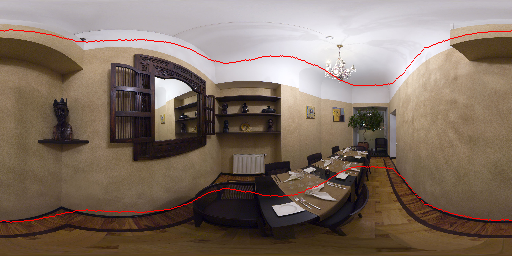
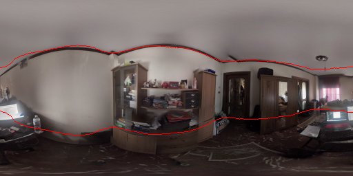

# Abstract

> Spherical cameras capture scenes in a holistic manner and have been used for room layout estimation. Recently, with the availability of appropriate datasets, there has also been progress in depth estimation from a single omnidirectional image. While these two tasks are complementary, few works have been able to explore them in parallel to advance indoor geometric perception, and those that have done so either relied on synthetic data, or used small scale datasets, as few options are available that include both layout annotations and dense depth maps in real scenes. This is partly due to the necessity of manual annotations for room layouts. In this work, we move beyond this limitation and generate a 360 geometric vision (360V) dataset that includes multiple modalities, multi-view stereo data and automatically generated weak layout cues. We also explore an explicit coupling between the two tasks to integrate them into a single-shot trained model. We rely on depth-based layout reconstruction and layout-based depth attention, demonstrating increased performance across both tasks. By using single 360 cameras to scan rooms, the opportunity for facile and quick building-scale 3D scanning arises.
More information can be found at [https://github.com/VCL3D/ExplicitLayoutDepth](https://github.com/VCL3D/ExplicitLayoutDepth).

# Highlights

- A multi-view color, depth, normals, semantic maps and weak layout cues 360 dataset.

- Method to reconstruct weak layout cues from multi-modal information.

- Explicit connection between the layout and depth estimation tasks

- Coarse-to-fine model for the explicitly connected layout and depth estimation tasks

# Paper

# Results

## Sun360

<iframe allowfullscreen webkitallowfullscreen width="640" height="480" frameborder="0" seamless src="https://p3d.in/e/VkKF0"></iframe>

<iframe allowfullscreen webkitallowfullscreen width="640" height="480" frameborder="0" seamless src="https://p3d.in/e/OFlGR"></iframe>

## Random

<iframe allowfullscreen webkitallowfullscreen width="640" height="480" frameborder="0" seamless src="https://p3d.in/e/Iug1B+spin"></iframe>

<iframe allowfullscreen webkitallowfullscreen width="640" height="480" frameborder="0" seamless src="https://p3d.in/e/hehIJ"></iframe>
